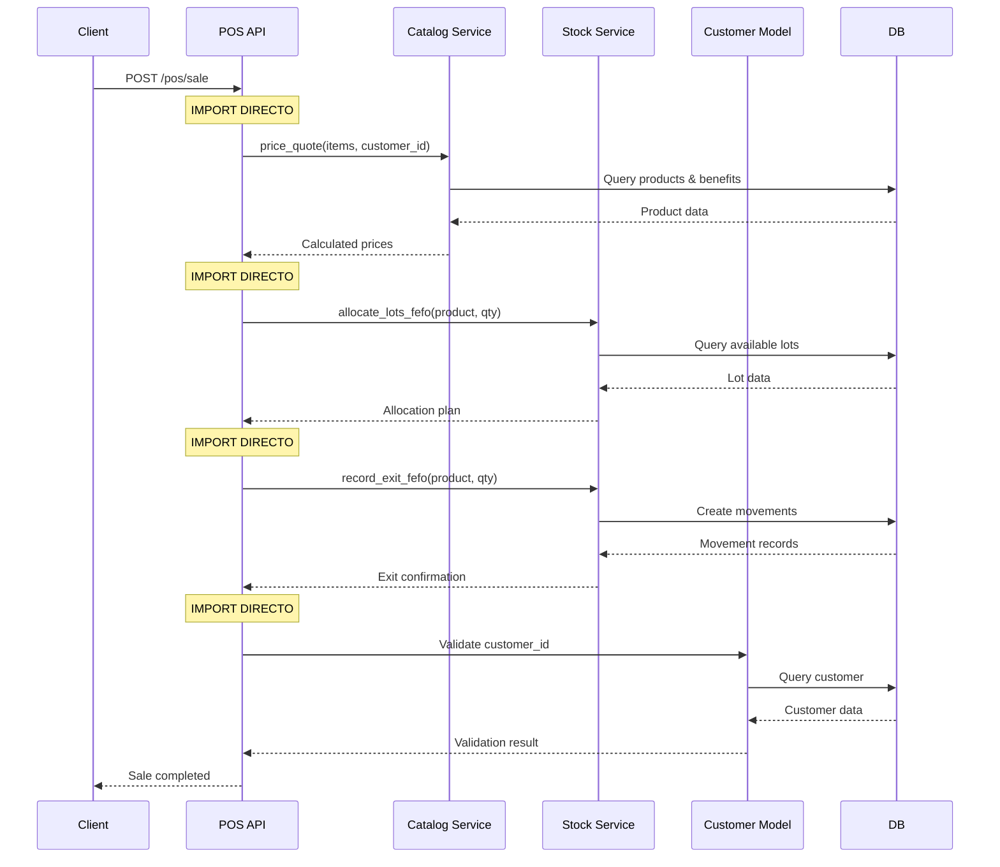
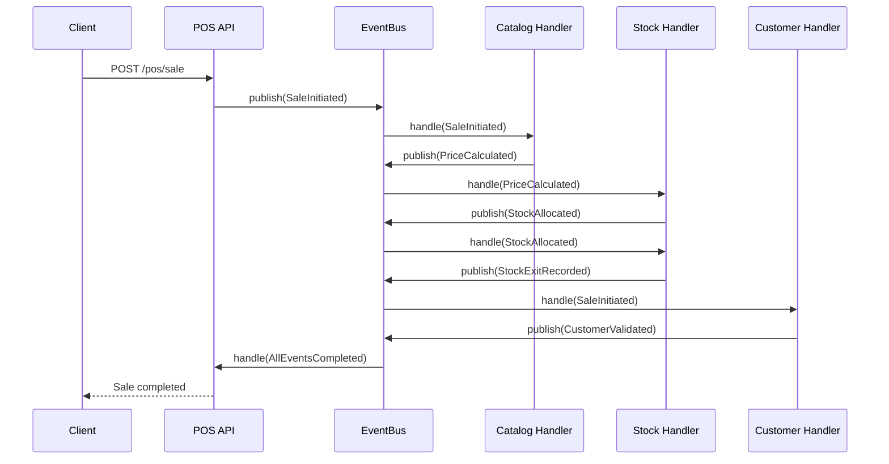
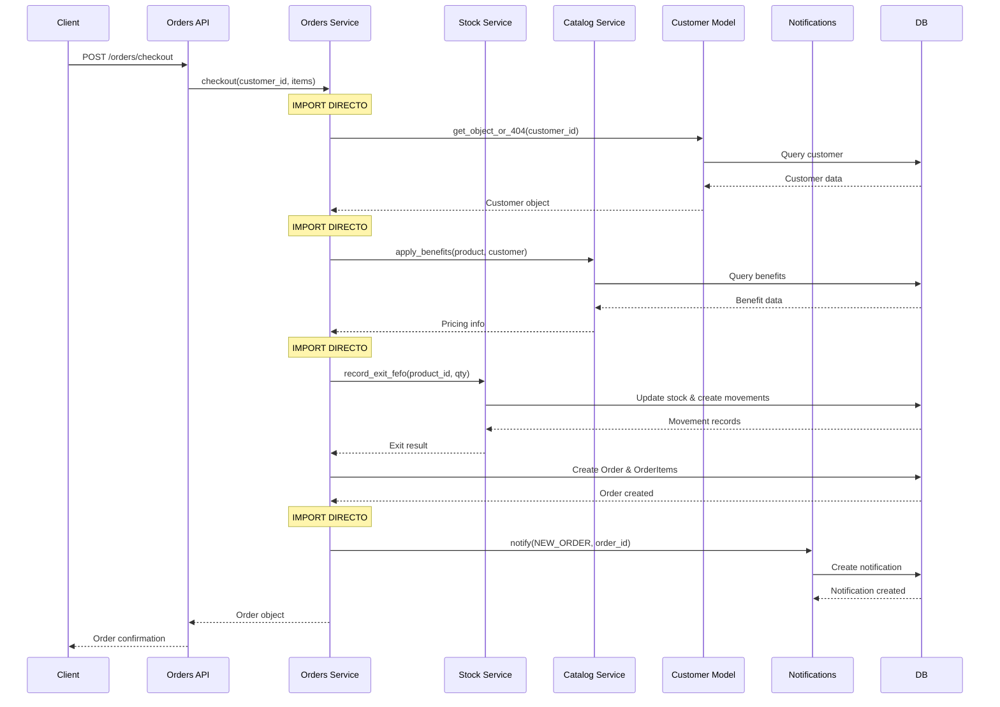
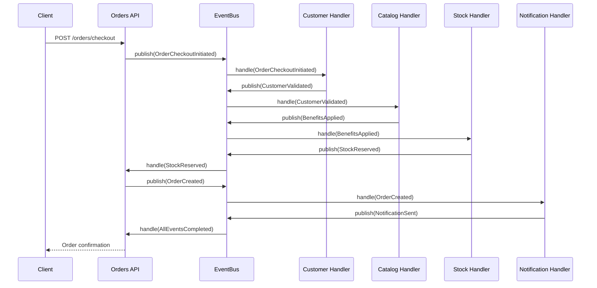
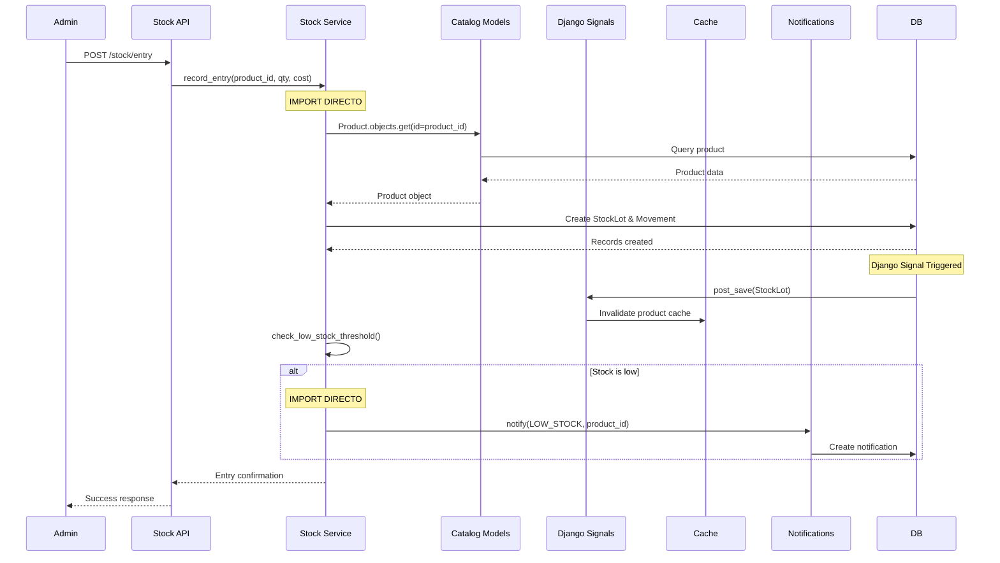
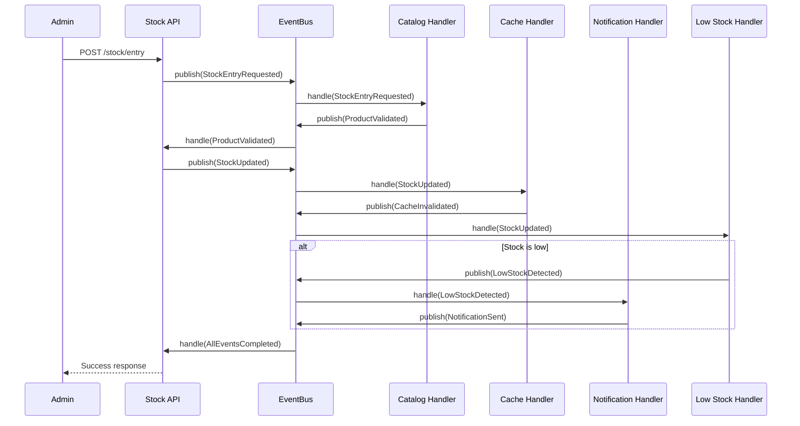
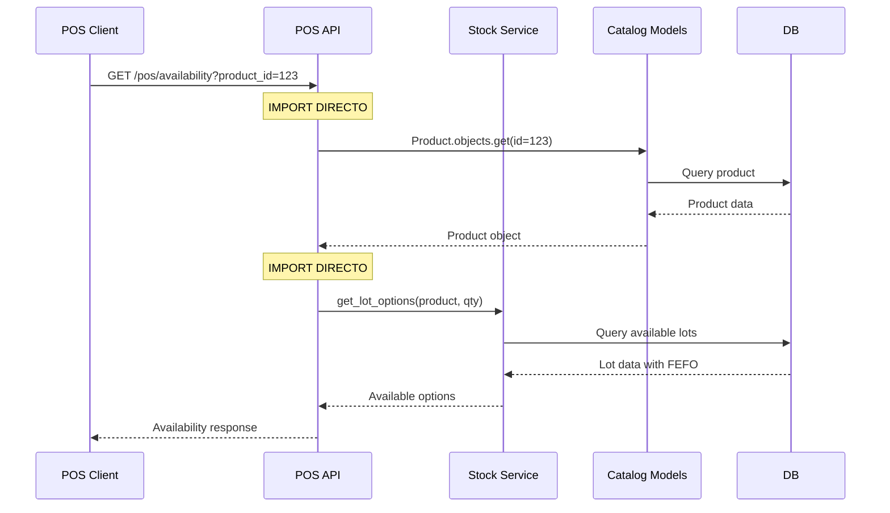
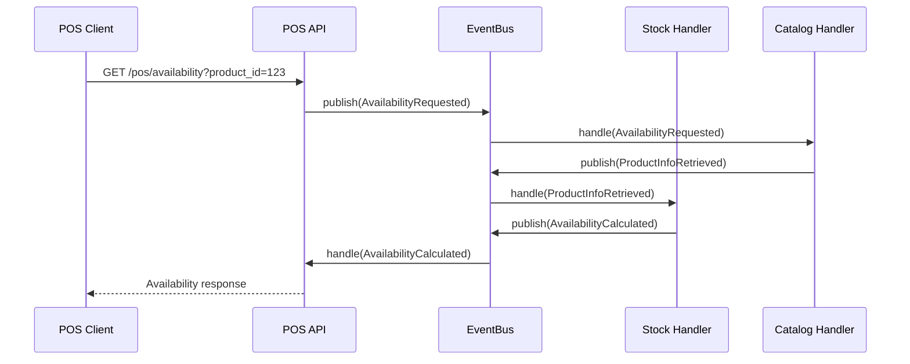

# Diagramas de Flujos Críticos - Estado Actual

## 🔄 Flujo 1: Venta POS Completa

### Estado Actual (Problemático)

**Problemas Identificados:**
- 4 imports directos en una sola operación
- Acoplamiento fuerte entre POS y otros dominios
- Difícil testing unitario (requiere mocks de 4 servicios)
- Transacciones complejas distribuidas en múltiples servicios

### Estado Objetivo (Event-Driven)

**Beneficios:**
- 0 imports directos
- Cada handler es testeable independientemente
- Fácil agregar nuevos handlers (ej: loyalty points)
- Mejor manejo de errores y rollback

---

## 🛒 Flujo 2: Checkout de Orden

### Estado Actual (Problemático)

**Problemas Identificados:**
- 4 imports directos en checkout
- Lógica de negocio distribuida en múltiples servicios
- Difícil rollback si falla algún paso
- Testing requiere setup complejo de múltiples dominios

### Estado Objetivo (Event-Driven)

---

## 📦 Flujo 3: Actualización de Stock

### Estado Actual (Problemático)

**Problemas Identificados:**
- Import directo de Catalog models en Stock
- Mezcla de imports directos y Django signals
- Lógica de low stock mezclada con entrada de stock
- Notificaciones acopladas al servicio de stock

### Estado Objetivo (Event-Driven)

---

## 🔍 Flujo 4: Consulta de Disponibilidad (POS)

### Estado Actual (Problemático)

### Estado Objetivo (Event-Driven)

---

## 📊 Análisis de Complejidad por Flujo

### Métricas Actuales:
| Flujo | Imports Directos | Servicios Involucrados | Tiempo Promedio | Complejidad Ciclomática |
|-------|------------------|------------------------|-----------------|-------------------------|
| Venta POS | 4 | 5 | 200ms | 12 |
| Checkout Orden | 4 | 6 | 350ms | 15 |
| Actualización Stock | 2 | 4 | 50ms | 8 |
| Consulta Disponibilidad | 2 | 3 | 80ms | 6 |

### Métricas Objetivo (Post Event-Driven):
| Flujo | Imports Directos | Handlers | Tiempo Estimado | Complejidad Estimada |
|-------|------------------|----------|-----------------|---------------------|
| Venta POS | 0 | 4 | 180ms | 6 |
| Checkout Orden | 0 | 5 | 320ms | 8 |
| Actualización Stock | 0 | 3 | 45ms | 4 |
| Consulta Disponibilidad | 0 | 2 | 75ms | 3 |

## 🎯 Casos Edge Identificados

### 1. **Fallo en Medio de Venta POS**
**Actual**: Rollback manual complejo
**Objetivo**: Event sourcing con compensating actions

### 2. **Stock Insuficiente Durante Checkout**
**Actual**: Exception propagada a través de imports
**Objetivo**: StockInsufficientEvent → OrderCancelledEvent

### 3. **Producto Discontinuado Durante Venta**
**Actual**: Error en runtime por import directo
**Objetivo**: ProductDiscontinuedEvent → SaleBlockedEvent

### 4. **Concurrencia en Reserva de Stock**
**Actual**: Race conditions en imports directos
**Objetivo**: StockReservationConflictEvent → RetryEvent

---

## 🚀 Próximos Pasos para Fase 2

### Eventos a Diseñar (Basados en Flujos):
1. **SaleInitiated, PriceCalculated, StockAllocated**
2. **OrderCheckoutInitiated, CustomerValidated, BenefitsApplied**
3. **StockEntryRequested, StockUpdated, LowStockDetected**
4. **AvailabilityRequested, ProductInfoRetrieved, AvailabilityCalculated**

### Handlers a Implementar:
1. **CatalogHandler**: Pricing, benefits, product validation
2. **StockHandler**: Allocation, reservation, availability
3. **CustomerHandler**: Validation, preferences
4. **NotificationHandler**: Alerts, emails, SMS

### Contratos a Definir:
1. **Event schemas** con versionado
2. **Handler interfaces** estándar
3. **Error handling** patterns
4. **Retry policies** por tipo de evento

---

**Análisis completado**: ✅
**Flujos críticos identificados**: 4
**Casos edge documentados**: 4
**Listo para Fase 2**: ✅